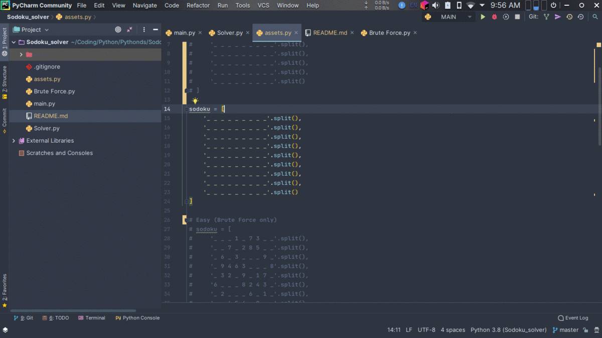
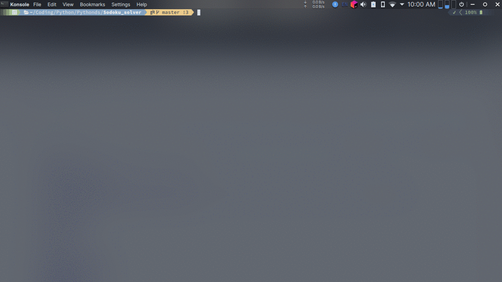

# Sodoku Solver
Solving Sodoku by testing as many possibilities as needed.

##### To try out 'Soduku Solver':
**1) Insert your sodoku puzzle in asset.py (Sodoku map must be an array name `sodoku`)**
___

**2) Run main.py**
___

#### **What I have learned:**
- Improve OOP knowledge
- Study "Object calls Object" technique (Recursion)
- Learn about copy and deepcopy.
- Gain a better understanding of python set

#### **What I can do better**
- Name variables, methods, function clearer (currently having a confusing naming scheme)
- Better UI